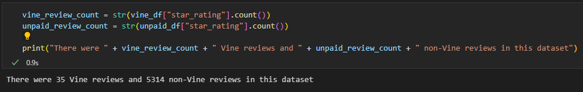
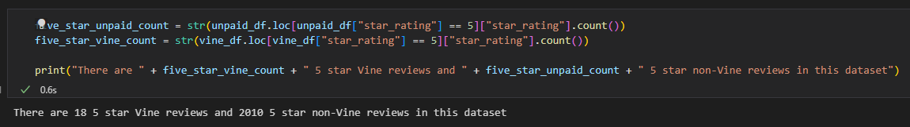
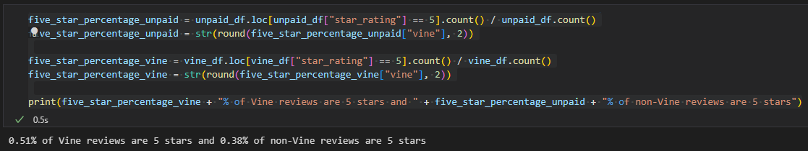

# Amazon_Vine_Analysis

### Overview
I have gathered major appliances review data from amazon's vine service and analyze this data to determine if there is a positivity bias in vine reviews.

### Results

#### How many Vine reviews and non-Vine reviews were there?

- 35 Vine reviews
- 5314 non-Vine reviews

#### How many Vine reviews were 5 stars? How many non-Vine reviews were 5 stars?

- 18 5 star Vine reviews
- 2010 5 star non-Vine reviews

#### What percentage of Vine reviews were 5 stars? What percentage of non-Vine reviews were 5 stars?

- 0.51% of Vine reviews are 5 stars 
- 0.38% of non-Vine reviews are 5 stars

### Summary

In the major appliances dataset provided by Amazon, I found that Vine has a positivity bias towards 5 star reviews, with 0.51% of Vine reviews were 5 stars and 0.38% of non-Vine reviews were 5 stars. This is a major difference in the data and can be caused due to a number of factors. One reason could be that vine reviewers receive these products for free. Another reason for such a large difference in the reviews could be that less that 0.01% of the reviews are vine reviews, and can cause a scew in the data due to there not being sufficient vine review data, and gathering more vine reviews could even out the dataset.

I can further analyse this data by excluding products that Vine reviewers did not review, and gather the overall rating and review count of those products, to determine if their review had a significant impact on the mean, thus supporting or oposing the positivity bias theory.

